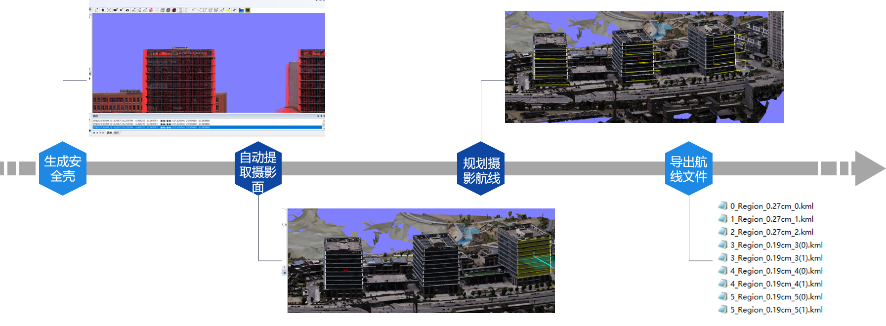
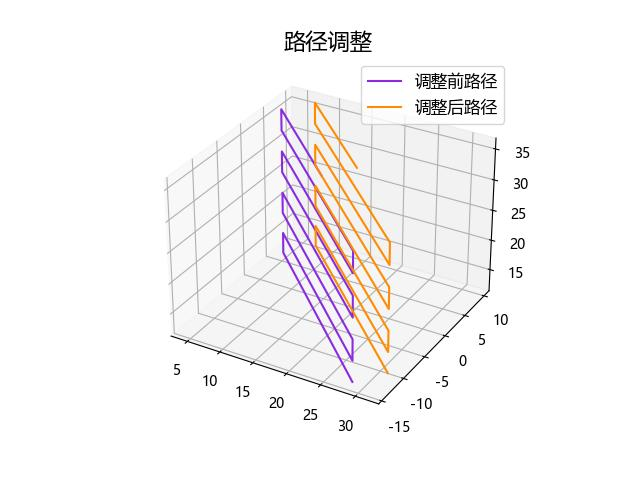

# UAV intelligent route planning and acquisition of building curtain wall images
#### 摘要
针对建筑幕墙出现的面板破损脱落、移位变形等问题及灾后的应急性快速安全检测，利用无人机搭载深度学习模型，考虑烟雾污渍、环境影像的投射和倒影等因素对检测结果的干扰识别，研究基于无人机智能航线规划与摄像的玻璃幕墙图像采集，解决人工操控无人机耗时耗力的低效作业方式；研究适用于无人机搭载巡检识别一体化系统，解决二安全航测只能规划、大规模数据实时处理分析、基于深度学习的破损、移位、变形等实时检测、通信实时传输、检测结果数字信息可视化等问题；研究玻璃幕墙检测结果工程档案的信息化系统，解决检测结果数字化保存及检测结果数据库的构建问题。

## 目录
  * [安装](#安装)              
  * [内容](#内容)
    + [键盘控制](#键盘控制)
    + [NAP航线规划](#NAP航线规划)
    + [路径调整](#路径调整)
    + [避障](#避障)
    + + [障碍物检测](#障碍物检测)
    + + ~~避障算法~~
  * [资料汇总](#资料汇总)

## 安装
    $ git clone https://github.com/ssljd/Based-on-UAV-intelligent-route-planning-and-Curtain-wall-image-acquisition-technology
    $ cd Based-on-UAV-intelligent-route-planning-and-Curtain-wall-image-acquisition-technology/
    $ pip install -r requirements.txt

## 内容
#### 键盘控制
| 键盘 | 功能 |
| :-----: | :-----: |
| k | 获取无人机控制 |
| l | 释放无人机控制 |
| w | 控制无人机前进 |
| s | 控制无人机后退 |
| a | 控制无人机左移 |
| d | 控制无人机右移 |
| $\downarrow$ | 控制无人机下降 |
| $\uparrow$ | 控制无人机上升 |
| $\leftarrow$ | 控制无人机左转 |
| $\rightarrow$ | 控制无人机右转 |
| enter | 拍照 |
| r | 开始录制 |
| q | 停止录制 |

#### NAP航线规划

#### 路径调整

- 坐标转换  
坐标转换使用的原理是GPS转化成局部坐标系（将无人机的起飞点的GPS坐标作为参考值）：先将经纬度从度数转换为弧度，将无人机的起飞点的GPS坐标的经纬度也从度数转化成弧度，分别获取NAP和GPS参考坐标经度对应弧度的正弦余弦值,通过其正余弦值的差值获得NAP经纬度与GPS参考坐标的差距比例，再乘以地球半径获得NAP在GPS环境下的坐标系，其具体公式如下：
> $a = lat_{ref} \times\frac{\pi}{180}$, $b=lat\times\frac{\pi}{180}$, $c = lon \times\frac{\pi}{180}$, $d = lon_{ref} \times\frac{\pi}{180}$  
> 
> $x = k(\cos a\times \sin b - \sin a \times \cos b \times \cos (c-a))\times 637100$  
> 
> $y=k(\cos b \times \sin (c-d))\times 637100$  
> 
> 其中 $lat_{ref}$ 是参考坐标经度, $lon_{ref}$ 是参考坐标纬度, $lat$ 是当前坐标经度, $lon$ 是当前坐标纬度。  

#### 避障
##### 障碍物检测
1.	获取DepthPlanar（平面深度图像）、DepthPerspective（透视深度图像）和Segmentation（分割图像）三种类型图像。
2.	通过DepthPlanar和DepthPerspective来获取障碍物的方向，并计算其相对位置。
3.	利用Segmentation图像将图像中的每个像素点分配到不同的类别中，如背景、人、车、树等。
4.	对每个类别对象进行逐个检测，利用该类别对相应的像素点与DepthPerspective（透视深度图像）进行计算，获取它的距离，然后与设定的阈值进行对比，如果小于阈值，获取该物体的最大最小位置，生成Box3D对象。

## 成果展示
#### 无人机智能航线规划采集建筑幕墙图像视频
https://www.bilibili.com/video/BV11h4y1f7dh/

#### 多线程无人机智能航线规划采集建筑幕墙图像视频
https://www.bilibili.com/video/BV1th4y177Ng/

## 资料汇总
| 相关资料 | 链接地址 |
| :-----: | :-----: |
| Airsim官方文档 | [link](https://github.com/microsoft/AirSim) |
| Airsim | [link](https://microsoft.github.io/AirSim/) |
| Airsim环境搭建 | [link](https://blog.csdn.net/qq_41071754/article/details/119561844) |
| Airsim和python环境搭建 | [link](https://blog.csdn.net/dbqwcl/article/details/128618922?csdn_share_tail=%7B%22type%22%3A%22blog%22%2C%22rType%22%3A%22article%22%2C%22rId%22%3A%22128618922%22%2C%22source%22%3A%22unlogin%22%7D) |
| UE4加载本地倾斜模型流程 | [link](https://www.bilibili.com/video/BV1fT4y1v7JE/?share_source=copy_web&vd_source=c1672af9d0b6d625c84667b5a523677a) |
| cesiumlab工具下载 | [link](http://www.cesiumlab.com/) |
| osg2cesiumApp工具下载 | [link](https://www.jianshu.com/p/e1ee883ff7a5) |
| Airsim雷达使用 | [link](https://blog.csdn.net/joeshuai/article/details/122191910) |
| lidar数据获取并显示 | [link](https://ldgcug.github.io/2019/08/30/Airsim/%E5%88%9D%E8%AF%86Airsim%EF%BC%88%E5%8D%81%EF%BC%89%E4%B9%8BLidar%E6%95%B0%E6%8D%AE%E8%8E%B7%E5%8F%96%E5%B9%B6%E6%98%BE%E7%A4%BA/) |
 | NAP软件工具 | [link](http://www.cesiumlab.com/) |
| NAP使用说明 |  [link](https://www.yuque.com/u2146681/nfp_manual) |
| NAP教程视频 | [link](https://www.bilibili.com/video/BV1RM4y1g7Gw/?p=1&share_medium=android&share_plat=android&share_session_id=9a596187-75ab-4dd6-9757-a6a6fe304a87&share_source=COPY&share_tag=s_i&timestamp=1632791496&unique_k=52zV6x&vd_source=c1672af9d0b6d625c84667b5a523677a) |
| 人工势场法(APF)避障 | [link](https://blog.csdn.net/k_kun/article/details/126036987?spm=1001.2014.3001.5502) |
| Airsim学习日志 | [link](https://blog.csdn.net/k_kun/category_11892372.html) |
